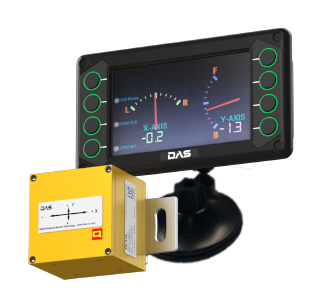
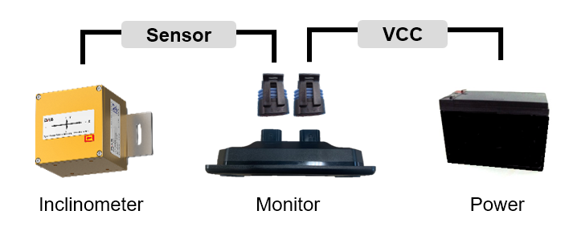
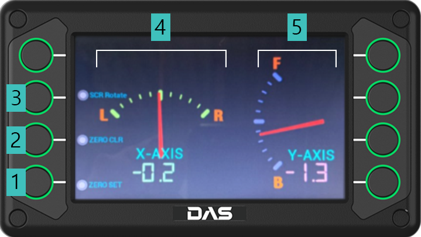

<!DOCTYPE html>
<html lang="ko">
<head>
    <meta charset="UTF-8">
    <meta name="viewport" content="width=device-width, initial-scale=1.0">
    <title>AT-200 디지털 경사계 시스템 사용자 매뉴얼</title>
    <link rel="stylesheet" href="styles.css">
</head>
<body>
    

        <!-- 헤더 -->
        <header class="manual-header">
            

                <h1>AT-200 디지털 경사계 시스템</h1>
                
사용자 매뉴얼

                

                    제조사: (주)다스
                    모델: AT-200
                    버전: 2024
                

            

        </header>

        <!-- 목차 -->
        <nav class="manual-nav" id="toc">
            <h2>목차</h2>
            <ol>
                <li><a href="#section1">1. 개요</a></li>
                <li><a href="#section2">2. 안전 수칙</a></li>
                <li><a href="#section3">3. 설치</a></li>
                <li><a href="#section4">4. 운영</a></li>
                <li><a href="#section5">5. 유지보수</a></li>
                <li><a href="#section6">6. 문제해결</a></li>
                <li><a href="#section7">7. 기술 사양</a></li>
                <li><a href="#section8">8. 부록</a></li>
            </ol>
        </nav>

        <!-- 메인 콘텐츠 -->
        <main class="manual-content">
            <!-- 섹션 1: 개요 -->
            <section class="manual-section" id="section1">
                <h2>1. 개요</h2>
                
                <h3>1.1 제품 소개</h3>
                
AT-200 디지털 경사계 시스템은 고정밀 MEMS 기반 기울기 센서를 사용하여 정확한 각도 측정을 제공하는 산업용 측정 장비입니다. 건설, 토목, 기계 설치 등 다양한 산업 분야에서 활용 가능합니다.

                
                

                    
                    
그림 1-1. AT-200 디지털 경사계 시스템

                

                
                <h3>1.2 주요 특징</h3>
                <ul>
                    <li>고정밀 MEMS 기반 기울기 센서</li>
                    <li>측정 범위: ±5° (최대 ±80°)</li>
                    <li>5인치 TFT LCD 디스플레이 (800x400 해상도)</li>
                    <li>IP67 방수 등급 (센서부)</li>
                    <li>넓은 동작 온도 범위 (-20℃ ~ +85℃)</li>
                    <li>CAN 통신 지원</li>
                </ul>

                <h3>1.3 시스템 구성</h3>
                

                    
                    
그림 1-2. AT-200 시스템 구성도

                

                
                <table class="manual-table">
                    <tr>
                        <th>구성품</th>
                        <th>설명</th>
                        <th>수량</th>
                    </tr>
                    <tr>
                        <td>경사계 센서</td>
                        <td>MEMS 기반 기울기 센서 (IP67)</td>
                        <td>1</td>
                    </tr>
                    <tr>
                        <td>디스플레이 모니터</td>
                        <td>5인치 TFT LCD 디스플레이</td>
                        <td>1</td>
                    </tr>
                    <tr>
                        <td>센서 케이블</td>
                        <td>30m 길이 (MG610331-5 커넥터)</td>
                        <td>1</td>
                    </tr>
                    <tr>
                        <td>전원 케이블</td>
                        <td>10m 길이</td>
                        <td>1</td>
                    </tr>
                    <tr>
                        <td>사용자 매뉴얼</td>
                        <td>본 문서</td>
                        <td>1</td>
                    </tr>
                </table>
            </section>

            <!-- 섹션 2: 안전 수칙 -->
            <section class="manual-section" id="section2">
                <h2>2. 안전 수칙</h2>
                
                

                    <h3>⚠️ 경고</h3>
                    
본 제품을 사용하기 전에 반드시 안전 수칙을 숙지하고 준수하시기 바랍니다.

                

                <h3>2.1 전기 안전</h3>
                <ul>
                    <li>입력 전원은 10~30Vdc 범위를 준수하십시오.</li>
                    <li>젖은 손으로 전원 연결부를 만지지 마십시오.</li>
                    <li>케이블 연결 시 전원을 차단한 상태에서 작업하십시오.</li>
                    <li>손상된 케이블은 즉시 교체하십시오.</li>
                </ul>

                <h3>2.2 설치 환경</h3>
                <ul>
                    <li>사용 온도 범위를 준수하십시오:
                        <ul>
                            <li>모니터: -25℃ ~ +65℃</li>
                            <li>센서: -20℃ ~ +85℃</li>
                        </ul>
                    </li>
                    <li>직사광선을 피하여 설치하십시오.</li>
                    <li>진동이 심한 곳은 피하십시오.</li>
                    <li>센서는 IP67 방수 등급이나, 모니터는 실내용입니다.</li>
                </ul>

                <h3>2.3 취급 주의사항</h3>
                

                    <h4>📋 주의</h4>
                    <ul>
                        <li>제품을 떨어뜨리거나 충격을 가하지 마십시오.</li>
                        <li>임의로 분해하거나 개조하지 마십시오.</li>
                        <li>화학물질이나 용제로 청소하지 마십시오.</li>
                        <li>품질 보증 기간은 구입 후 1년입니다.</li>
                    </ul>
                

            </section>

            <!-- 섹션 3: 설치 -->
            <section class="manual-section" id="section3">
                <h2>3. 설치</h2>
                
                <h3>3.1 설치 전 확인사항</h3>
                <ul>
                    <li>모든 구성품이 포함되어 있는지 확인하십시오.</li>
                    <li>케이블에 손상이 없는지 검사하십시오.</li>
                    <li>설치 장소의 전원 사양을 확인하십시오 (10~30Vdc).</li>
                </ul>

                <h3>3.2 설치 순서</h3>
                

                    <h4>Step 1: 경사계 센서 설치</h4>
                    <ol>
                        <li>측정하고자 하는 위치에 센서를 고정합니다.</li>
                        <li>센서가 수평을 이루도록 조정합니다.</li>
                        <li>제공된 브라켓을 사용하여 단단히 고정합니다.</li>
                    </ol>
                    
                    

                        
                        
그림 3-1. 경사계 센서 설치

                    

                    <h4>Step 2: 케이블 연결</h4>
                    

                        <table class="manual-table">
                            <tr>
                                <th>선 색상</th>
                                <th>기능</th>
                                <th>설명</th>
                            </tr>
                            <tr>
                                <td>적색</td>
                                <td>V+</td>
                                <td>전원 양극 (10~30Vdc)</td>
                            </tr>
                            <tr>
                                <td>흑색</td>
                                <td>GND</td>
                                <td>전원 음극 (공통)</td>
                            </tr>
                            <tr>
                                <td>녹색</td>
                                <td>CAN H</td>
                                <td>CAN 통신 High</td>
                            </tr>
                            <tr>
                                <td>흰색</td>
                                <td>CAN L</td>
                                <td>CAN 통신 Low</td>
                            </tr>
                        </table>
                    

                    

                        <h4>⚠️ 결선 시 주의사항</h4>
                        <ul>
                            <li>전원을 차단한 상태에서 결선하십시오.</li>
                            <li>극성을 반드시 확인하십시오.</li>
                            <li>케이블 길이: 센서 케이블 30m, 전원 케이블 10m</li>
                        </ul>
                    

                    <h4>Step 3: 모니터 설치</h4>
                    <ol>
                        <li>모니터를 원하는 위치에 설치합니다.</li>
                        <li>전원 케이블을 연결합니다.</li>
                        <li>센서 케이블을 모니터에 연결합니다.</li>
                    </ol>

                    <h4>Step 4: 전원 연결 및 확인</h4>
                    <ol>
                        <li>모든 연결이 완료되었는지 확인합니다.</li>
                        <li>전원을 인가합니다 (10~30Vdc).</li>
                        <li>모니터가 정상적으로 켜지는지 확인합니다.</li>
                        <li>초기 화면에서 센서 연결 상태를 확인합니다.</li>
                    </ol>
                

                <h3>3.3 설치 완료 후 점검</h3>
                <ul>
                    <li>센서가 올바른 각도를 표시하는지 확인</li>
                    <li>통신 상태 LED 확인</li>
                    <li>모든 케이블이 단단히 고정되었는지 확인</li>
                </ul>
            </section>

            <!-- 섹션 4: 운영 -->
            <section class="manual-section" id="section4">
                <h2>4. 운영</h2>
                
                <h3>4.1 디스플레이 인터페이스</h3>
                

                    
                    
그림 4-1. 디스플레이 인터페이스 구성

                

                

                    <h4>화면 구성 요소</h4>
                    <table class="manual-table display-components-table">
                        <tr>
                            <th style="width: 60px;">번호</th>
                            <th style="width: 150px;">구성 요소</th>
                            <th>설명</th>
                        </tr>
                        <tr>
                            <td>①</td>
                            <td>영점 설정</td>
                            <td>현재 측정값을 0°로 설정합니다. 설정 시 ±2° 내에서 설정 진행합니다.</td>
                        </tr>
                        <tr>
                            <td>②</td>
                            <td>영점 설정 취소</td>
                            <td>설정된 영점을 취소하고 초기 상태로 돌아갑니다.</td>
                        </tr>
                        <tr>
                            <td>③</td>
                            <td>화면 표시 전환</td>
                            <td>가로 표시와 세로 표시를 전환합니다.</td>
                        </tr>
                        <tr>
                            <td>④</td>
                            <td>X축 표시계</td>
                            <td>X축의 기울기를 아날로그 게이지와 디지털 수치로 표시합니다. 현재 예시: -0.2°</td>
                        </tr>
                        <tr>
                            <td>⑤</td>
                            <td>Y축 표시계</td>
                            <td>Y축의 기울기를 아날로그 게이지와 디지털 수치로 표시합니다. 현재 예시: 1.3°</td>
                        </tr>
                    </table>
                

                <h4>디스플레이 특징</h4>
                <ul>
                    <li>듀얼 축 동시 표시: X축과 Y축의 경사를 동시에 확인 가능</li>
                    <li>아날로그 게이지: 직관적인 시각적 표시로 빠른 상태 확인</li>
                    <li>디지털 수치 표시: 정확한 각도값을 0.1° 단위로 표시</li>
                    <li>색상 구분: 측정 범위에 따라 색상으로 구분하여 경고 표시</li>
                </ul>

                <h3>4.2 키패드 조작법</h3>
                
AT-200은 디스플레이 양측에 배치된 8개의 기능 버튼을 통해 조작됩니다.

                
                <table class="manual-table keypad-table">
                    <tr>
                        <th style="width: 150px;">버튼 위치</th>
                        <th style="width: 120px;">기능</th>
                        <th>설명</th>
                    </tr>
                    <tr>
                        <td>좌측 상단 ①</td>
                        <td>영점 설정</td>
                        <td>현재 위치를 0°로 설정합니다. ±2° 범위 내에서만 설정 가능합니다.</td>
                    </tr>
                    <tr>
                        <td>좌측 중상단 ②</td>
                        <td>영점 설정 취소</td>
                        <td>설정된 영점을 해제하고 원래 값으로 복원합니다.</td>
                    </tr>
                    <tr>
                        <td>좌측 중하단 ③</td>
                        <td>화면 표시 전환</td>
                        <td>가로 모드↔세로 모드로 화면 표시를 전환합니다.</td>
                    </tr>
                    <tr>
                        <td>좌측 하단</td>
                        <td>메뉴/설정</td>
                        <td>설정 메뉴로 진입하거나 이전 화면으로 돌아갑니다.</td>
                    </tr>
                    <tr>
                        <td>우측 상단</td>
                        <td>위 이동 (▲)</td>
                        <td>메뉴 항목을 위로 이동하거나 값을 증가시킵니다.</td>
                    </tr>
                    <tr>
                        <td>우측 중상단</td>
                        <td>아래 이동 (▼)</td>
                        <td>메뉴 항목을 아래로 이동하거나 값을 감소시킵니다.</td>
                    </tr>
                    <tr>
                        <td>우측 중하단</td>
                        <td>선택/확인</td>
                        <td>현재 선택을 확인하거나 설정을 저장합니다.</td>
                    </tr>
                    <tr>
                        <td>우측 하단</td>
                        <td>취소/나가기</td>
                        <td>현재 작업을 취소하거나 이전 화면으로 돌아갑니다.</td>
                    </tr>
                </table>

                

                    <h4>💡 조작 팁</h4>
                    <ul>
                        <li>영점 설정은 측정 기준면이 ±2° 이내일 때만 가능합니다.</li>
                        <li>화면 전환 기능으로 설치 방향에 따라 최적의 표시 모드를 선택할 수 있습니다.</li>
                        <li>버튼은 짧게 누르면 단일 동작, 길게 누르면 연속 동작이 가능합니다.</li>
                    </ul>
                

                <h3>4.3 기본 측정 작업</h3>
                <h4>4.3.1 전원 켜기</h4>
                <ol>
                    <li>전원이 연결되면 자동으로 시스템이 시작됩니다.</li>
                    <li>초기화 화면이 표시됩니다 (약 3초).</li>
                    <li>메인 측정 화면이 나타납니다.</li>
                </ol>

                <h4>4.3.2 영점 설정</h4>
                <ol>
                    <li>측정 기준이 되는 위치에 센서를 놓습니다.</li>
                    <li>ZERO 버튼을 누릅니다.</li>
                    <li>확인 메시지가 나타나면 ENTER를 누릅니다.</li>
                    <li>현재 위치가 0.0°로 설정됩니다.</li>
                </ol>

                

                    <h4>💡 팁</h4>
                    
정확한 측정을 위해 영점 설정 시 센서가 안정된 상태인지 확인하십시오.

                

                <h4>4.3.3 측정값 읽기</h4>
                <ul>
                    <li>X축 경사: 화면 상단에 표시</li>
                    <li>Y축 경사: 화면 하단에 표시 (2축 모델)</li>
                    <li>측정 범위: ±5° (기본), 최대 ±80°</li>
                    <li>분해능: 0.1°</li>
                </ul>

                <h3>4.4 고급 설정</h3>
                <h4>4.4.1 측정 범위 변경</h4>
                <ol>
                    <li>MENU 버튼을 눌러 설정 메뉴로 진입</li>
                    <li>"측정 범위" 항목 선택</li>
                    <li>◀/▶ 버튼으로 원하는 범위 선택</li>
                    <li>ENTER로 확인</li>
                </ol>

                <h4>4.4.2 통신 설정</h4>
                <ul>
                    <li>CAN 통신 속도 설정</li>
                    <li>노드 ID 설정</li>
                    <li>데이터 전송 주기 설정</li>
                </ul>

                <h4>4.4.3 디스플레이 설정</h4>
                <ul>
                    <li>밝기 조절 (5단계)</li>
                    <li>자동 꺼짐 시간 설정</li>
                    <li>표시 단위 변경 (도/라디안)</li>
                </ul>
            </section>

            <!-- 섹션 5: 유지보수 -->
            <section class="manual-section" id="section5">
                <h2>5. 유지보수</h2>
                
                <h3>5.1 정기 점검</h3>
                <table class="manual-table">
                    <tr>
                        <th>점검 주기</th>
                        <th>점검 항목</th>
                        <th>조치 사항</th>
                    </tr>
                    <tr>
                        <td>일일</td>
                        <td>측정값 이상 유무</td>
                        <td>영점 재설정</td>
                    </tr>
                    <tr>
                        <td>주간</td>
                        <td>케이블 상태</td>
                        <td>손상 시 교체</td>
                    </tr>
                    <tr>
                        <td>월간</td>
                        <td>센서 고정 상태</td>
                        <td>볼트 조임 확인</td>
                    </tr>
                    <tr>
                        <td>분기</td>
                        <td>전체 시스템 점검</td>
                        <td>청소 및 교정</td>
                    </tr>
                </table>

                <h3>5.2 청소 및 관리</h3>
                <h4>5.2.1 모니터 청소</h4>
                <ul>
                    <li>부드러운 마른 천으로 닦아주십시오.</li>
                    <li>심한 오염 시 물기를 짠 천으로 닦은 후 마른 천으로 마무리하십시오.</li>
                    <li>화학물질이나 용제를 사용하지 마십시오.</li>
                </ul>

                <h4>5.2.2 센서 청소</h4>
                <ul>
                    <li>센서 표면의 먼지나 이물질을 제거하십시오.</li>
                    <li>IP67 방수 등급이므로 물로 세척 가능합니다.</li>
                    <li>세척 후 완전히 건조시키십시오.</li>
                </ul>

                <h3>5.3 교정</h3>
                
정확한 측정을 위해 연 1회 교정을 권장합니다.

                <ol>
                    <li>평평한 기준면에 센서를 설치합니다.</li>
                    <li>메뉴에서 "교정 모드"를 선택합니다.</li>
                    <li>화면의 지시에 따라 교정을 진행합니다.</li>
                    <li>교정 완료 후 측정값을 확인합니다.</li>
                </ol>

                

                    <h4>📋 참고</h4>
                    
전문적인 교정이 필요한 경우 제조사 서비스 센터에 문의하십시오.

                

                <h3>5.4 보관</h3>
                <ul>
                    <li>장기간 사용하지 않을 경우 전원을 차단하십시오.</li>
                    <li>건조하고 서늘한 곳에 보관하십시오.</li>
                    <li>보관 온도: -40℃ ~ +85℃</li>
                    <li>습도: 95% RH 이하 (결로 없을 것)</li>
                </ul>
            </section>

            <!-- 섹션 6: 문제해결 -->
            <section class="manual-section" id="section6">
                <h2>6. 문제해결</h2>
                
                <h3>6.1 일반적인 문제와 해결방법</h3>
                
                <table class="manual-table troubleshooting">
                    <tr>
                        <th>증상</th>
                        <th>가능한 원인</th>
                        <th>해결 방법</th>
                    </tr>
                    <tr>
                        <td>전원이 켜지지 않음</td>
                        <td>
                            <ul>
                                <li>전원 미연결</li>
                                <li>전압 부족</li>
                                <li>퓨즈 손상</li>
                            </ul>
                        </td>
                        <td>
                            <ul>
                                <li>전원 연결 확인</li>
                                <li>입력 전압 확인 (10~30Vdc)</li>
                                <li>퓨즈 교체</li>
                            </ul>
                        </td>
                    </tr>
                    <tr>
                        <td>측정값이 불안정함</td>
                        <td>
                            <ul>
                                <li>센서 고정 불량</li>
                                <li>진동 발생</li>
                                <li>케이블 접촉 불량</li>
                            </ul>
                        </td>
                        <td>
                            <ul>
                                <li>센서 고정 상태 확인</li>
                                <li>진동원 제거</li>
                                <li>케이블 연결 확인</li>
                            </ul>
                        </td>
                    </tr>
                    <tr>
                        <td>통신 오류</td>
                        <td>
                            <ul>
                                <li>케이블 손상</li>
                                <li>통신 설정 오류</li>
                                <li>노이즈 간섭</li>
                            </ul>
                        </td>
                        <td>
                            <ul>
                                <li>케이블 교체</li>
                                <li>통신 파라미터 확인</li>
                                <li>차폐 케이블 사용</li>
                            </ul>
                        </td>
                    </tr>
                    <tr>
                        <td>디스플레이 이상</td>
                        <td>
                            <ul>
                                <li>밝기 설정 문제</li>
                                <li>케이블 연결 불량</li>
                                <li>하드웨어 고장</li>
                            </ul>
                        </td>
                        <td>
                            <ul>
                                <li>밝기 재설정</li>
                                <li>케이블 재연결</li>
                                <li>서비스 센터 문의</li>
                            </ul>
                        </td>
                    </tr>
                </table>

                <h3>6.2 에러 코드</h3>
                <table class="manual-table">
                    <tr>
                        <th>에러 코드</th>
                        <th>설명</th>
                        <th>조치 사항</th>
                    </tr>
                    <tr>
                        <td>E001</td>
                        <td>센서 연결 오류</td>
                        <td>센서 케이블 연결 확인</td>
                    </tr>
                    <tr>
                        <td>E002</td>
                        <td>통신 타임아웃</td>
                        <td>통신 케이블 및 설정 확인</td>
                    </tr>
                    <tr>
                        <td>E003</td>
                        <td>측정 범위 초과</td>
                        <td>센서 위치 조정 또는 범위 설정 변경</td>
                    </tr>
                    <tr>
                        <td>E004</td>
                        <td>메모리 오류</td>
                        <td>전원 재시작, 지속 시 서비스 문의</td>
                    </tr>
                    <tr>
                        <td>E005</td>
                        <td>교정 필요</td>
                        <td>교정 모드 실행</td>
                    </tr>
                </table>

                <h3>6.3 응급 조치</h3>
                

                    <h4>⚠️ 긴급 상황 시</h4>
                    <ol>
                        <li>즉시 전원을 차단하십시오.</li>
                        <li>모든 연결을 확인하십시오.</li>
                        <li>시스템을 재시작하십시오.</li>
                        <li>문제가 지속되면 서비스 센터에 연락하십시오.</li>
                    </ol>
                

                <h3>6.4 FAQ (자주 묻는 질문)</h3>
                

                    <h4>Q: 영점이 자꾸 변경됩니다.</h4>
                    
A: 센서가 완전히 고정되지 않았거나 온도 변화가 심한 경우 발생할 수 있습니다. 센서 고정을 확인하고 온도가 안정된 후 재설정하십시오.

                    <h4>Q: 측정값이 실제와 다릅니다.</h4>
                    
A: 교정이 필요할 수 있습니다. 교정 모드를 실행하거나 서비스 센터에 문의하십시오.

                    <h4>Q: 화면이 깜빡입니다.</h4>
                    
A: 전원 공급이 불안정할 수 있습니다. 입력 전압을 확인하고 안정적인 전원을 사용하십시오.

                

            </section>

            <!-- 섹션 7: 기술 사양 -->
            <section class="manual-section" id="section7">
                <h2>7. 기술 사양</h2>
                
                <h3>7.1 디스플레이 모니터 사양</h3>
                <table class="manual-table specs-table">
                    <tr>
                        <th>항목</th>
                        <th>사양</th>
                        <th>비고</th>
                    </tr>
                    <tr>
                        <td>디스플레이</td>
                        <td>5인치 TFT LCD</td>
                        <td>600cd/㎡</td>
                    </tr>
                    <tr>
                        <td>해상도</td>
                        <td>WVGA (800×400)</td>
                        <td>5:3 비율</td>
                    </tr>
                    <tr>
                        <td>입력 장치</td>
                        <td>8버튼 키패드</td>
                        <td>-</td>
                    </tr>
                    <tr>
                        <td>전원</td>
                        <td>10~30Vdc</td>
                        <td>-</td>
                    </tr>
                    <tr>
                        <td>소비 전류</td>
                        <td>Max 300mA</td>
                        <td>@12Vdc</td>
                    </tr>
                    <tr>
                        <td>사용 온도</td>
                        <td>-25℃ ~ +65℃</td>
                        <td>-</td>
                    </tr>
                    <tr>
                        <td>보관 온도</td>
                        <td>-40℃ ~ +85℃</td>
                        <td>-</td>
                    </tr>
                    <tr>
                        <td>외형 크기</td>
                        <td>W170 × D47.7 × H96mm</td>
                        <td>-</td>
                    </tr>
                    <tr>
                        <td>중량</td>
                        <td>약 450g</td>
                        <td>-</td>
                    </tr>
                </table>

                <h3>7.2 경사계 센서 사양</h3>
                <table class="manual-table specs-table">
                    <tr>
                        <th>항목</th>
                        <th>사양</th>
                        <th>비고</th>
                    </tr>
                    <tr>
                        <td>측정 축</td>
                        <td>1축 또는 2축</td>
                        <td>모델별 상이</td>
                    </tr>
                    <tr>
                        <td>측정 범위</td>
                        <td>±5° (최대 ±80°)</td>
                        <td>설정 가능</td>
                    </tr>
                    <tr>
                        <td>분해능</td>
                        <td>0.1°</td>
                        <td>-</td>
                    </tr>
                    <tr>
                        <td>정확도</td>
                        <td>±0.2°</td>
                        <td>@25℃</td>
                    </tr>
                    <tr>
                        <td>센서 타입</td>
                        <td>MEMS 기울기 센서</td>
                        <td>-</td>
                    </tr>
                    <tr>
                        <td>전원</td>
                        <td>10~30Vdc</td>
                        <td>-</td>
                    </tr>
                    <tr>
                        <td>소비 전류</td>
                        <td>60mA</td>
                        <td>@12Vdc</td>
                    </tr>
                    <tr>
                        <td>방수 등급</td>
                        <td>IP67</td>
                        <td>-</td>
                    </tr>
                    <tr>
                        <td>동작 온도</td>
                        <td>-20℃ ~ +85℃</td>
                        <td>-</td>
                    </tr>
                    <tr>
                        <td>외형 크기</td>
                        <td>W65 × D65 × H55mm</td>
                        <td>브라켓 제외</td>
                    </tr>
                    <tr>
                        <td>케이블 길이</td>
                        <td>30m</td>
                        <td>표준 제공</td>
                    </tr>
                    <tr>
                        <td>커넥터</td>
                        <td>MG610331-5</td>
                        <td>한국단자공업</td>
                    </tr>
                </table>

                <h3>7.3 통신 사양</h3>
                <table class="manual-table">
                    <tr>
                        <th>항목</th>
                        <th>사양</th>
                    </tr>
                    <tr>
                        <td>통신 방식</td>
                        <td>CAN 2.0B</td>
                    </tr>
                    <tr>
                        <td>통신 속도</td>
                        <td>125/250/500/1000 kbps</td>
                    </tr>
                    <tr>
                        <td>노드 ID</td>
                        <td>1~127 (설정 가능)</td>
                    </tr>
                    <tr>
                        <td>데이터 전송 주기</td>
                        <td>10~1000ms (설정 가능)</td>
                    </tr>
                </table>

                <h3>7.4 환경 사양</h3>
                <table class="manual-table">
                    <tr>
                        <th>항목</th>
                        <th>사양</th>
                    </tr>
                    <tr>
                        <td>동작 습도</td>
                        <td>5~95% RH (결로 없을 것)</td>
                    </tr>
                    <tr>
                        <td>진동</td>
                        <td>10~55Hz, 1.5mm 진폭</td>
                    </tr>
                    <tr>
                        <td>충격</td>
                        <td>30G, 11ms</td>
                    </tr>
                    <tr>
                        <td>EMC</td>
                        <td>CE 규격 준수</td>
                    </tr>
                </table>
            </section>

            <!-- 섹션 8: 부록 -->
            <section class="manual-section" id="section8">
                <h2>8. 부록</h2>
                
                <h3>8.1 용어 설명</h3>
                <dl class="glossary">
                    <dt>MEMS (Micro Electro Mechanical Systems)</dt>
                    <dd>초소형 전자기계 시스템으로, 마이크로미터 크기의 기계 부품과 전자 회로가 하나의 기판 위에 집적된 장치입니다.</dd>
                    
                    <dt>CAN (Controller Area Network)</dt>
                    <dd>차량 및 산업용 장비에서 사용되는 신뢰성 높은 통신 프로토콜입니다.</dd>
                    
                    <dt>IP67</dt>
                    <dd>먼지로부터 완전히 보호되며, 1m 깊이의 물에 30분간 잠겨도 손상되지 않는 방수 등급입니다.</dd>
                    
                    <dt>분해능 (Resolution)</dt>
                    <dd>측정 가능한 최소 단위로, AT-200의 경우 0.1도입니다.</dd>
                    
                    <dt>영점 설정 (Zero Setting)</dt>
                    <dd>현재 위치를 기준점(0도)으로 설정하는 기능입니다.</dd>
                </dl>

                <h3>8.2 품질 보증</h3>
                

                    <h4>보증 기간</h4>
                    
구입일로부터 1년간 무상 보증됩니다.

                    
                    <h4>보증 범위</h4>
                    <ul>
                        <li>정상적인 사용 중 발생한 고장</li>
                        <li>제조상의 결함</li>
                    </ul>
                    
                    <h4>보증 제외 사항</h4>
                    <ul>
                        <li>사용자 과실로 인한 손상</li>
                        <li>임의 분해 또는 개조</li>
                        <li>천재지변으로 인한 손상</li>
                        <li>소모품 (케이블 등)</li>
                    </ul>
                

                <h3>8.3 인증 정보</h3>
                <ul>
                    <li>CE 인증</li>
                    <li>RoHS 준수</li>
                    <li>KC 인증 (한국)</li>
                </ul>

                <h3>8.4 제조사 정보</h3>
                

                    <table class="manual-table">
                        <tr>
                            <td>회사명</td>
                            <td>(주)다스</td>
                        </tr>
                        <tr>
                            <td>홈페이지</td>
                            <td>www.das-co.com</td>
                        </tr>
                        <tr>
                            <td>고객 지원</td>
                            <td>sales@das-co.com</td>
                        </tr>
                        <tr>
                            <td>전화</td>
                            <td>031-356-3541</td>
                        </tr>
                        <tr>
                            <td>본사</td>
                            <td>전북 김제시 지평선산단 3길 61</td>
                        </tr>
                        <tr>
                            <td>A/S센터 및 화성공장</td>
                            <td>경기도 화성시 비봉로 128</td>
                        </tr>
                    </table>
                

                <h3>8.5 개정 이력</h3>
                <table class="manual-table">
                    <tr>
                        <th>버전</th>
                        <th>일자</th>
                        <th>내용</th>
                    </tr>
                    <tr>
                        <td>1.0</td>
                        <td>2024.01.01</td>
                        <td>초판 발행</td>
                    </tr>
                </table>

                

                    <h4>📋 참고사항</h4>
                    
본 매뉴얼의 내용은 제품의 성능 향상을 위해 사전 예고 없이 변경될 수 있습니다.

                    
최신 버전의 매뉴얼은 제조사 홈페이지에서 다운로드할 수 있습니다.

                

            </section>
        </main>

        <!-- 푸터 -->
        <footer class="manual-footer">
            
&copy; 2024 (주)다스. All rights reserved.

            
AT-200 디지털 경사계 시스템 사용자 매뉴얼 v1.0

        </footer>
    

    <!-- 인쇄 시 페이지 번호 -->
    

</body>
</html>
